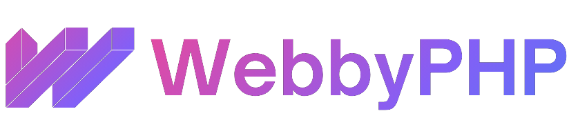

<p align="center">
    
</p>

[](https://github.com/tterb/atomic-design-ui/blob/master/LICENSEs)    

## About WebbyPHP
---
WebbyPHP is a lightweight, modular, “lego-style” PHP framework designed to make building APIs, CLI/Console tools, and Web Applications simple, modern, and enjoyable—especially for beginners.

Built as an enhanced extension of CodeIgniter 3, WebbyPHP brings a fresh, modern developer experience (DX) while keeping the simplicity, speed, and small footprint that made CI3 popular. It also introduces flexible modular architecture, improved routing, and integration patterns that make it easy to combine packages or even borrow concepts from other PHP frameworks.

Build powerful PHP applications with a simple, sweet, and scalable architecture.

## Features

- Improved and Modern Routing
- HMVC First Architecture
- Supports API-only, Console/CLI, or Web Apps
- Easy Integration with Other Frameworks & PHP Packages
- Extendable with Standalone WebbyPHP Packages
- “Plates” Templating Engine (configurable Blade-like views)
- Use “Services” to organize business logic
- Use “Actions” for CRUD or isolated logic
- Forms/Rules for Request Validation
- Use "Forms Or Rules" to validate input requests
- Near Service-Discovery-Like Features
- Bring Your Own Database Layer — any library or abstraction works

## Authors

- [@otengkwame](https://www.github.com/otengkwame)
- [All Contributors][webby-contributors]
- [All Sylynder Engine Contributors][engine-contributors]

## Installation

We recommend installing WebbyPHP via Composer
 [Composer](https://getcomposer.org/).
Are you new to Composer? Read this short guide: [Read this short guide:](https://getcomposer.org/doc/00-intro.md) click on the link.

Install WebbyPHP:
This will install the latest PHP supported version:

```bash
$ composer create-project webbyphp/webby <project-name>
```

Replace <project-name> with your preferred project folder name.


## Documentation

The main documentation lives here: [WebbyPHP Docs](https://webbyphp.top/docs)

Documentation is actively being expanded. We’re updating it continuously, and the accompanying Blog section will include beginner-friendly guides to help you learn the framework step-by-step.

If you’re already familiar with CodeIgniter 3 and HMVC, you will feel at home immediately.

For deeper CI3 references, you may also visit:
https://www.codeigniter.com/userguide3/index.html

The concept of CodeIgniter 4 has not been so clear and rewriting CodeIgniter 3 has set the framework back in so many ways, this is a way to show that Codeigniter could have been improved gradually without the approach the Core Team used.

## Why WebbyPHP?
CodeIgniter 4 moved in a direction that left many CI3 developers behind. WebbyPHP demonstrates that CI3 could evolve gradually—without breaking its simplicity.

## Server Requirements

WebbyPHP recommends PHP 8.3+.

PHP 8.3's support is for backward compatibility there were issues in CI3, but these have been resolved. WebbyPHP now supports:

- PHP 8.3 (You should be upgrading to PHP 8.4)

- PHP 8.4

- PHP 8.5 and Newer versions as compatibility is confirmed

If you encounter issues on more recent PHP versions, you’re free to report them — we fix compatibility continuously.

## Quick FAQs

#### Why did you create WebbyPHP?
---
To give beginners a PHP framework that is simple, predictable, and easy to learn.

To provide a gentle introduction to modern PHP without overwhelming concepts.

Because most modern frameworks are powerful—but intimidating for new developers.

CodeIgniter 3 stalled for a long time, and updating it became a good learning journey in software architecture, framework design, and extensibility.


#### Is WebbyPHP different from CodeIgniter 3 or 4?
---
WebbyPHP is built on the core of CodeIgniter 3, while borrowing improvements and modern patterns inspired by CodeIgniter 4.

Its goal is to help CI3 developers transition smoothly toward more modern PHP development—but with a familiar, stable syntax.


## Important Links

The links below will guide you to know more about how Webby Works

* [Installation Guide](https://webbyphp.top/docs/installation/)
* [Getting Started](https://webbyphp.top/docs/getting-started/)
* [Contribution Guide](https://webbyphp.top/docs/contribution-guide/)
* [Learn Webby](https://blog.webbyphp.top)
* [Community](https://github.com/webbyphp/engine/discussions)


## Credits

- Kwame Oteng Appiah Nti (https://github.com/otengkwame)
- [All Contributors][engine-contributors]


## License

We are using the MIT License (MIT). Please see our LICENSE.md file. If you want to know more about the license go to [LICENSE]((https://choosealicense.com/licenses/mit/)) for more information.

[webby-contributors]: https://github.com/webbyphp/webby/contributors

[engine-contributors]: https://github.com/webbyphp/engine/contributors
